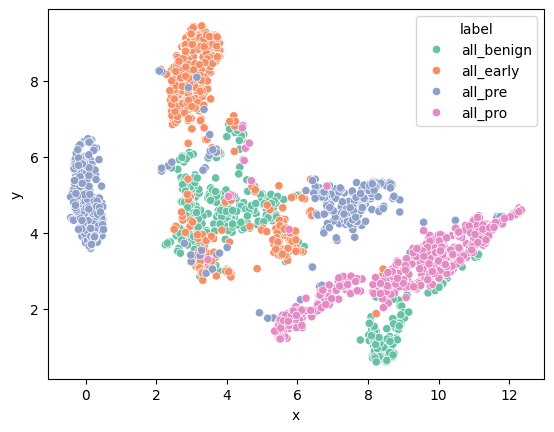
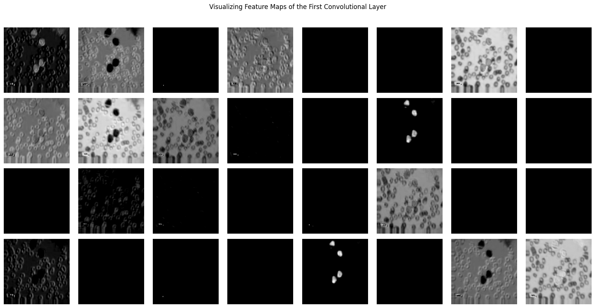
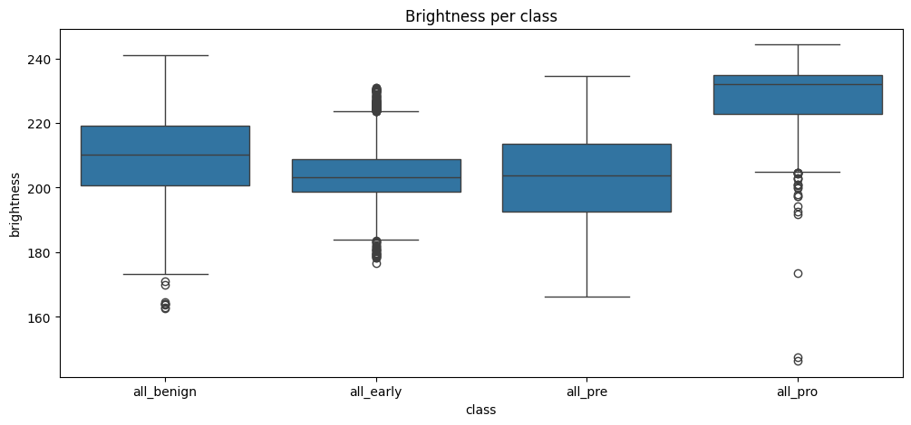
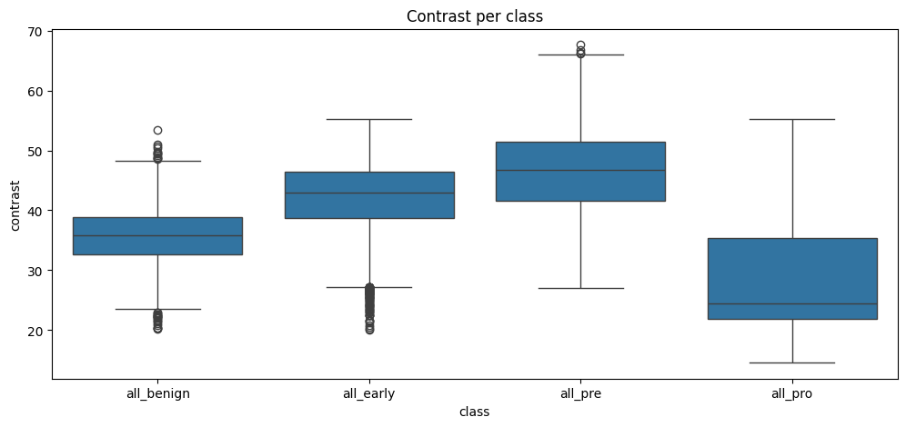
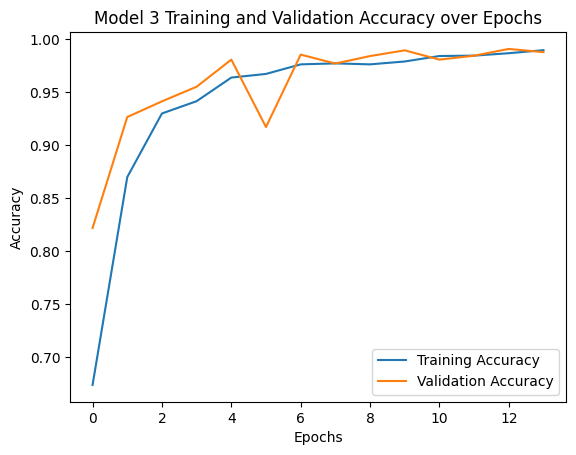

# Final Report (12/10)

-   Visualizations of data (interactive visualizations are highly encouraged).
-   Description of data processing and modeling (what the code does).
-   Results showing that you achieved your goal.

## Presentation Link

## Local build instructions

In the root directory, run `make`. You will be prompted to input your Kaggle username and a personal API Token. You can retrieve your username by going to `Your Profile` on the Kaggle website, and your API Token by going to `Settings` and navigating to `API Tokens`. Generate a new token, and paste the given token key into the prompt.

Thus, `make` will automatically create a `venv` with the required packages, download the dataset, and start preprocessing and running the model, before creating the visualizations.

## Data processing

The images were already augmented and preprocessed in the dataset. The documentation of the dataset describes the augmentation step as using Keras's `ImageDataGenerator` with the following parameters:

```
from keras.preprocessing.image import ImageDataGenerator

ImageDataGenerator(
    rotation_range=10,
    width_shift_range=0.1,
    height_shift_range=0.1,
    shear_range=0.1,
    zoom_range=0.1,
    horizontal_flip=True,
    fill_mode='nearest',
    brightness_range=[0.2, 1.2]
)
```

The augmentations include:

-   Rotation: Up to 10 degrees.
-   Width & Height Shift: Up to 10% of the total image size.
-   Shearing & Zooming: 10% variation.
-   Horizontal Flip: Randomly flips images for additional diversity.
-   Brightness Adjustment: Ranges from 0.2 to 1.2 for varying light conditions.

The images were then processed to be consistent 512x512 pixels in size, with files renamed consistently.

### Data split and model preparation

We used `TensorFlow`'s `tensorflow.keras.utils.image_dataset_from_directory` to split the dataset into different subsets following our proposal:

-   Training: 70% (3,500 images/class is 14,000 images total)
-   Validation: 15% (750 images/class is 3,000 images total)
-   Testing: 15% (750 images/class is 3,000 images total)

We used the following parameters:

```
train_ds = tf.keras.utils.image_dataset_from_directory(
    data_dir,
    validation_split=0.3,  # 70% train
    subset="training",
    seed=123,
    image_size=(128, 128),  # resize all images
    batch_size=32
)
```

where `data_dir` is the dataset, `validation_split` is how much of the data we wanted under the label `subset`, with a determined shuffle `seed`, with all images resized to 128 x 128 pixels, in batch sizes of 32.

We then normalized all of the pixels in every image to be spread from $[0,1]$ instead of $[0,255]$ to improve convergence speed and ensure consistency among all features.

## Data modeling methods

We developed three Convolutional Neural Networks (CNN) using `TensorFlow`'s `tensorflow.keras.Sequential` model, with each model performing better than the last. The first model had 2 convolution layers and a max pooling layer. The second added a 25% dropout layer. The third and final added more of each layer for a final total of 4 convolution layers, 2 max pooling layers and 2 25% dropout layers.

Final CNN Architecture:

1. Conv2D (32 filters, 3×3, ReLU): Learns low-level spatial features such as edges, corners, and basic color/texture patterns.
2. Conv2D (64 filters, 3×3, ReLU): Captures more complex features by combining earlier low-level patterns into shapes and curves.
3. MaxPooling2D (2×2): Reduces spatial resolution, keeps the most salient activations, and decreases computation.
4. Dropout (p=0.25): Randomly drops 25% of neurons during training to reduce overfitting and improve generalization.
5. Conv2D (128 filters, 3×3, ReLU): Extracts higher-level, class-specific features such as cell texture patterns characteristic of ALL subtypes.
6. Conv2D (128 filters, 3×3, ReLU): Further refines and deepens the feature hierarchy, enabling detection of subtle differences between similar classes.
7. MaxPooling2D (2×2): Performs another spatial downsampling step, reducing dimensionality while preserving the strongest activations.
8. Dropout (p=0.25): Provides a second regularization stage to prevent co-adaptation of deep features and reduce overfitting.
9. GlobalAveragePooling2D: Converts each feature map into a single value by averaging spatial dimensions — drastically reduces parameters and improves model robustness compared to a Flatten layer.
10. Dense (128 units, ReLU): Learns compact, high-level representations from the global features to separate the four ALL subtypes.
11. Dense (4 units, Softmax): Produces a probability distribution over the 4 final classes.

We use ReLU activations to introduce non-linearity and improve learning efficiency. The output layer results are passed through a softmax function during loss computation.

## Preliminary results

After training the final model on the dataset, we obtained the following test results:

| Training Accuracy | Training Loss | Validation Accuracy | Validation Loss |
| ----------------- | ------------- | ------------------- | --------------- |
| 99.96%            | 0.0306        | 97.14%              | 0.00861         |

## Visualizations

### Dataset

To the untrained, naked human eye, it's nearly impossible to give a diagnosis purely from the images. **Figure 1** demonstrates random samples from the 4 classes.


**Figure 1**: Random images from the dataset.

### UMAP

We made a UMAP visualization of the training data to visualize the distinctiveness between each class -- shown in **Figure 2**. We used a pre-trained ResNet-50 deep learning model to get a rough overview of how the data might be organized. Looking at it, we can see that benign and early pre-b overlap, which logically makes sense for the disease, and explains the later confusion matrix for model 1. Additionally, Pre-B data points cluster closely to the benign and early Pre-B overlapping clusters, which aligns with the timeline of development of Pre-B ALL. Lastly, Pro-B has the most distinct grouping and is clustered far from the early Pre-B/Pre-B points which suggests a larger morphological difference between the two ALL subtypes.


**Figure 2**: UMAP representation of training data using ResNet50 model.

### Feature maps

To gain insight into how the CNN processes the ALL images, we visualized the feature maps after the first convolutional layer. We implemented a visualization function that

1. Passes an input image through the first convolutional layer of the model in evaluation mode.

2. Extracts and normalizes the resulting feature maps.

3. Displays a grid of the first 32 feature maps using grayscale intensity to represent activation strength.

An example visualization is shown in **Figure 3**, where each image corresponds to one feature map learned by the first convolutional layer. These maps typically capture low-level features such as edges, textures, and color gradients — foundational elements that deeper layers later combine into more complex patterns.


**Figure 3**: A visualization of feature maps from the first convolutional layer for a sample input image.

We also made box plots of the brightnesses and contrasts of the images in the dataset, as they could be a possible feature picked up by the model -- shown in **Figure 4** and **Figure 5**.


**Figure 4**: Box plots of the brightness of the images in each class.


**Figure 5**: Box plots of the contrast of the images in each class.

We also sketched out edge maps, as the edges of shapes could also be picked up by the model -- shown in **Figure 6**.


**Figure 6**: A sample of edge maps of one image from each class.

### Accuracy

We plotted the training and validation accuracy over each epoch to see how much better the model gets over time in **Figure 7**.


**Figure 7**: A visualization of the final model's training and validation accuracy over each epoch.

### Confusion Matrix

To see where our model struggled with classification, we generated a confusion matrix of our model, pictured in **Figure 8**. Note the biggest confusion is present between benign and early.


**Figure 8**: Confusion matrix for the final model.
