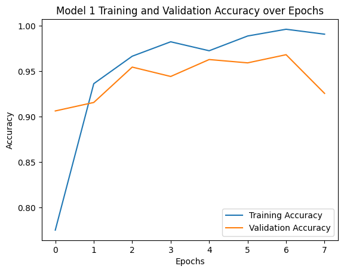

# Final Report (12/10)

- Visualizations of data (interactive visualizations are highly encouraged).
- Description of data processing and modeling (what the code does).
- Results showing that you achieved your goal.

## Presentation Link


## Local build instructions

In the root directory, run `make`. You will be prompted to input your Kaggle username and a personal API Token. You can retrieve your username by going to `Your Profile` on the Kaggle website, and your API Token by going to `Settings` and navigating to `API Tokens`. Generate a new token, and paste the given token key into the prompt.

Thus, `make` will automatically create a `venv` with the required packages, download the dataset, and start preprocessing and running the model, before creating the visualizations.

## Data processing

The images were already augmented and preprocessed in the dataset. The documentation of the dataset describes the augmentation step as using Keras's `ImageDataGenerator` with the following parameters:

```
from keras.preprocessing.image import ImageDataGenerator

ImageDataGenerator(
    rotation_range=10,
    width_shift_range=0.1,
    height_shift_range=0.1,
    shear_range=0.1,
    zoom_range=0.1,
    horizontal_flip=True,
    fill_mode='nearest',
    brightness_range=[0.2, 1.2]
)
```

The augmentations include:

-   Rotation: Up to 10 degrees.
-   Width & Height Shift: Up to 10% of the total image size.
-   Shearing & Zooming: 10% variation.
-   Horizontal Flip: Randomly flips images for additional diversity.
-   Brightness Adjustment: Ranges from 0.2 to 1.2 for varying light conditions.

The images were then processed to be consistent 512x512 pixels in size, with files renamed consistently.

### Data split and model preparation

We used `TensorFlow`'s `tensorflow.keras.utils.image_dataset_from_directory` to split the dataset into different subsets following our proposal:

-   Training: 70% (3,500 images/class is 14,000 images total)
-   Validation: 15% (750 images/class is 3,000 images total)
-   Testing: 15% (750 images/class is 3,000 images total)

We used the following parameters:

```
train_ds = tf.keras.utils.image_dataset_from_directory(
    data_dir,
    validation_split=0.3,  # 70% train
    subset="training",
    seed=123,
    image_size=(128, 128),  # resize all images
    batch_size=32
)
```

where `data_dir` is the dataset, `validation_split` is how much of the data we wanted under the label `subset`, with a determined shuffle `seed`, with all images resized to 128 x 128 pixels, in batch sizes of 32.

We then normalized all of the pixels in every image to be spread from $[0,1]$ instead of $[0,255]$ to improve convergence speed and ensure consistency among all features.

## Data modeling methods

We developed two Convolutional Neural Networks (CNN) using `TensorFlow`'s `tensorflow.keras.Sequential` model, the second being the same as the first but with an additional dropout layer. The first model is labeled `model1` and the second is labeled `model2`

CNN Architecture:

1. Conv2D (32 filters, 3×3, ReLU): learns low-level spatial features
2. Conv2D (64 filters, 3×3, ReLU): captures higher-order texture and shape features
3. MaxPooling2D (2×2): reduces spatial dimensions, retains key activations
4. Dropout (p=0.25): Regularizes the network and mitigates overfitting (omit this layer in our first model)4. Flatten: converts 3-D feature maps to a 1-D feature vector
5. Dense (128 units, ReLU): learns global feature representations for classification
6. Dense (4 units, Softmax): outputs class-probability distribution across the four ALL subtypes

We use ReLU activations to introduce non-linearity and improve learning efficiency. The output layer results are passed through a softmax function during loss computation.


## Preliminary results

After training both models on the dataset, we obtained the following test results:

| Model    | Training Accuracy | Training Loss | Validation Accuracy | Validation Loss |
| -------- | ----------------- | ------------- | ------------------- | --------------- |
| `model1` | 99.38%            | 0.0199        | 96.81%              | 0.1201          |
| `model2` | 98.36%            | 0.0568        | 94.28%              | 0.1693          |

This suggests that including a dropout might have caused underfitting. The simpler architecture of `model1` generalized better for this dataset, suggesting that the existing data diversity already mitigates overfitting.

## Preliminary visualizations

### Feature maps

To gain insight into how the CNN processes the ALL images, we visualized the feature maps after the first convolutional model. We implemented a visualization function that

1. Passes an input image through the first convolutional layer of the model in evaluation mode.

2. Extracts and normalizes the resulting feature maps.

3. Displays a grid of the first 32 feature maps using grayscale intensity to represent activation strength.

An example visualization is shown in **Figure 2**, where each image corresponds to one feature map learned by the first convolutional layer. These maps typically capture low-level features such as edges, textures, and color gradients — foundational elements that deeper layers later combine into more complex patterns.


**Figure 2**: A visualization of feature maps from the first convolutional layer for a sample input image.

### Accuracy

We plotted the training and validation accuracy over each epoch to see how much better the model gets over time in **Figure 3** and **Figure 4**.


**Figure 3**: A graph of accuracy against epoch, identifying the training accuracy and validation accuracy over each epoch for `model1`.


**Figure 4**: A graph of accuracy against epoch, identifying the training accuracy and validation accuracy over each epoch for `model2`.

### Confusion Matrix

To see where our model struggled with classification, we generated a confusion matrix of our model, pictured in **Figure 5**.


**Figure 5**: Confusion matrices for our model, where `0` is benign, `1` is early pre-b, `2` is pre-b, and `3` is pro-b.
