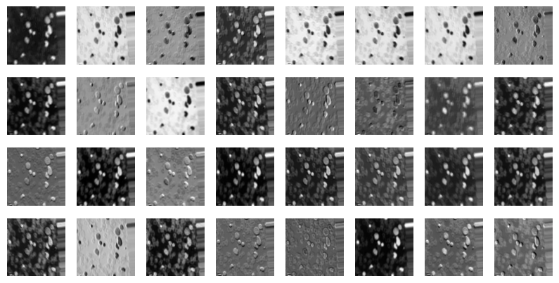
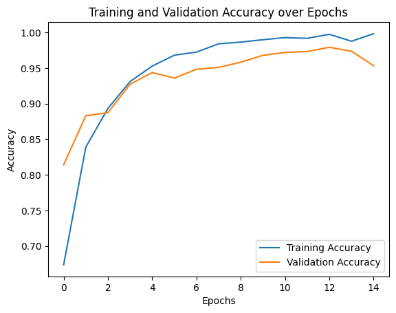

# Midterm Report (10/27)

We utilized two different machine learning packages to develop the same model: one using imports from `TensorFlow` and one from `PyTorch`. This report labels which package was utilized for the corresponding analysis in each section.

## Data processing
The images were already augmented and preprocessed in the dataset. The documentation of the dataset describes the augmentation step as using Keras's `ImageDataGenerator` with the following parameters:

```
from keras.preprocessing.image import ImageDataGenerator

ImageDataGenerator(
    rotation_range=10,         
    width_shift_range=0.1,     
    height_shift_range=0.1,    
    shear_range=0.1,           
    zoom_range=0.1,            
    horizontal_flip=True,      
    fill_mode='nearest',       
    brightness_range=[0.2, 1.2]
)
```
The augmentations include:
- Rotation: Up to 10 degrees.
- Width & Height Shift: Up to 10% of the total image size.
- Shearing & Zooming: 10% variation.
- Horizontal Flip: Randomly flips images for additional diversity.
- Brightness Adjustment: Ranges from 0.2 to 1.2 for varying light conditions.

The images were then processed to be consistent 512x512 pixels in size, with files renamed consistently.

### Data split and model preparation

#### TensorFlow:
We used `TensorFlow`'s `tensorflow.keras.utils.image_dataset_from_directory` to split the dataset into different subsets following our proposal:

- Training: 70% (3,500 images/class is 14,000 images total)
- Validation: 15% (750 images/class is 3,000 images total) 
- Testing: 15% (750 images/class is 3,000 images total)

We used the following parameters:

```
train_ds = tf.keras.utils.image_dataset_from_directory(
    data_dir,
    validation_split=0.3,  # 70% train
    subset="training",
    seed=123,
    image_size=(128, 128),  # resize all images
    batch_size=32
)
```

where `data_dir` is the dataset, `validation_split` is how much of the data we wanted under the label `subset`, with a determined shuffle `seed`, with all images resized to 128 x 128 pixels, in batch sizes of 32.

We then normalized all of the pixels in every image to be spread from $[0,1]$ instead of $[0,255]$ to improve convergence speed and ensure consistency among all features.

#### PyTorch:

We first assigned each category of Acute Lymphoblastic Leukemia (ALL) with an integer value:

``` 
{
    benign: 0,
    early pre-B: 1,
    pre-B: 2,
    pro-B: 3
}
```

We then iterated through the dataset and tagged each image with the appropriate integer label.

With every image labelled, we then randomly shuffled the images into different subsets following our proposal:

- Training: 70% (3,500 images/class is 14,000 images total)
- Validation: 15% (750 images/class is 3,000 images total) 
- Testing: 15% (750 images/class is 3,000 images total)

We put each subset into its own custom`ALLDatasetSplit` class that inherits from `torch.utils.data.Dataset` for future use. 

Through these steps, the dataset is properly structured, labelled, and randomly distributed for model training and evaluation.

To make the process more efficient and replicable, we utilized the `torch.utils.data.DataLoader` to specify batch sizing and minimize overfitting in the the training step.

## Data modeling methods

#### TensorFlow:
We developed a model using `TensorFlow`'s `tensorflow.keras.Sequential` model, with the following layers:

CNN Architecture:
1) Conv2D (32 filters, 3×3, ReLU): learns low-level spatial features
2) MaxPooling2D (2×2): reduces spatial dimensions, retains key activations
3) Conv2D (64 filters, 3×3, ReLU): captures higher-order texture and shape features
4) MaxPooling2D (2×2): further down-samples feature maps
5) Flatten: converts 3-D feature maps to a 1-D feature vector
6) Dense (128 units, ReLU): learns global feature representations for classification
7) Dense (4 units, Softmax): outputs class-probability distribution across the four ALL subtypes

We use ReLU activations to introduce non-linearity and improve learning efficiency. The output layer results are passed through a softmax function during loss computation.


#### PyTorch:
We developed two Convolutional Neural Networks (CNN) for multi-class image classification using Torch, the second being the same as the first but with an additional dropout layer. The first model is labeled `ALLCNN1` and the second is labeled `ALLCNN2`.

`ALLCNN2` Architecture:

1) Conv Layer 1: 3 input channels → 32 filters (3×3 kernel)

2) Conv Layer 2: 32 input channels → 64 filters (3×3 kernel)

3) Max Pooling: 2×2 pooling reduces spatial dimensions

4) Dropout (p=0.25): Regularizes the network and mitigates overfitting (omit this layer in our first model)

5) Flatten Layer: Converts feature maps to a 1D vector

6) Fully Connected Layer 1: 64 × 62 × 62 input features → 128 hidden units with ReLU activation

7) Fully Connected Layer 2 (Output): 128 input features → 4 output neurons (class logits)

All convolutional and fully connected layers use ReLU activations to introduce non-linearity and improve learning efficiency. The output layer produces raw class scores (logits), which are later passed through a softmax function during loss computation.

We implemented three helper functions to support training:

- `train_epoch` — performs one training iteration over the dataset,

- `validate_epoch` — evaluates performance on the validation set,

- `train_model` — coordinates the full training process over multiple epochs.

## Preliminary results

#### TensorFlow:

After 15 epochs of training, the model arrived at a final training accuracy of 0.9973, training loss of 0.0096, validation accuracy of 0.9531, and a validation loss of 0.1345.

#### PyTorch:

After training both models on the dataset, we obtained the following test results:

| Model | Test Accuracy | Test Loss
| --- | --- | --- |
| `ALLCNN1` | 95.30% | 0.1608 |
| `ALLCNN2` | 90.17% | 0.4016 |

This suggests that including a dropout might have caused underfitting. The simpler architecture of `ALLCNN1` generalized better for this dataset, suggesting that the existing data diversity already mitigates overfitting.

## Preliminary visualizations

### Feature maps
To gain insight into how the CNN processes the ALL images, we visualized the feature maps after the first convolutional model. We implemented a visualization function that 

1) Passes an input image through the first convolutional layer of the model in evaluation mode.

2) Extracts and normalizes the resulting feature maps.

3) Displays a grid of the first 32 feature maps using grayscale intensity to represent activation strength.

An example visualization is show in **Figure 1**, where each image corresponds to one feature map learned by the first convolutional layer. These maps typically capture low-level features such as edges, textures, and color gradients — foundational elements that deeper layers later combine into more complex patterns.


**Figure 1**: A visualization of feature maps from the first convolutional layer for a sample input image.

### Accuracy

We plotted the training and validation accuracy over each epoch to see how much better the model gets over time in **Figure 2**.


**Figure 2**: A graph of accuracy against epoch, identifying the training accuracy and validation accuracy over each epoch.